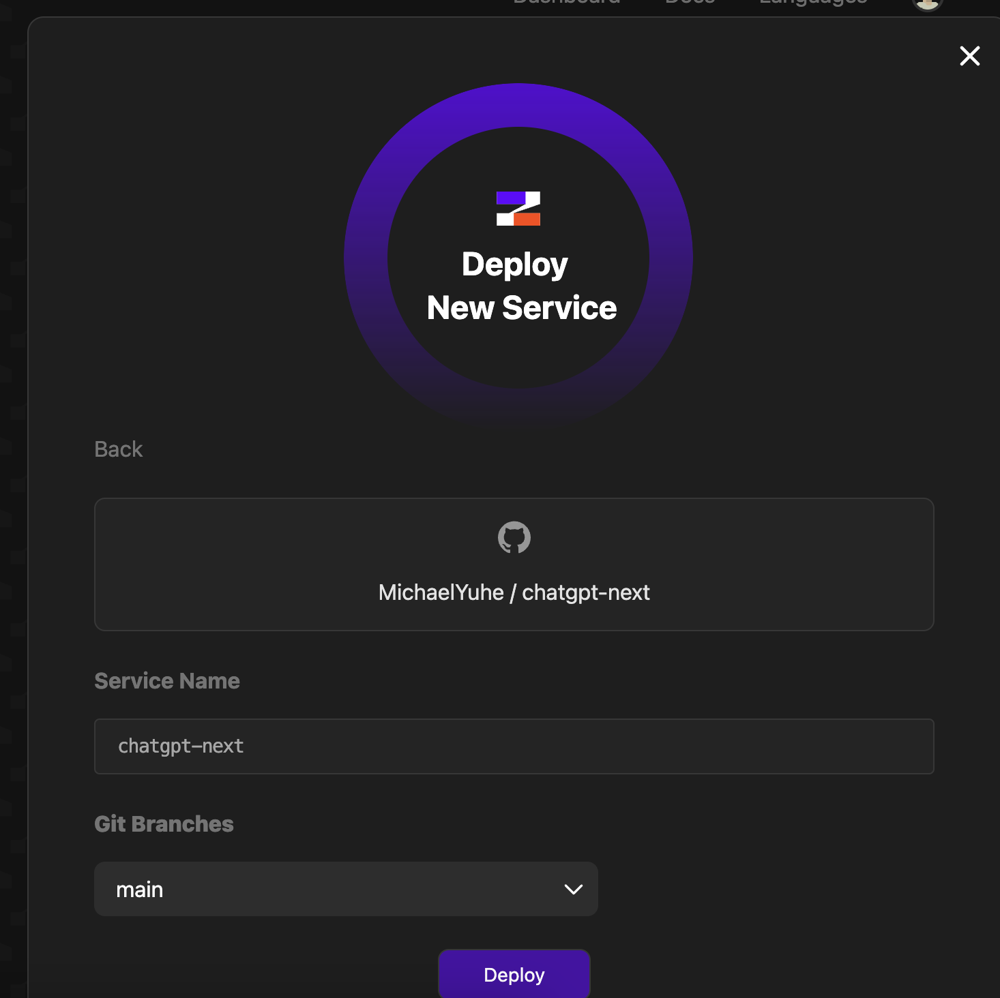

# ChatGPT Next

微信风格的 ChatGPT，基于 Next.js 构建，私有化部署的最佳选择！

https://chatgpt-next.com

备份网址：

- https://chatgpt-next-xcatliu.vercel.app
- https://chatgpt-next.zeabur.app

如果你也部署了一个站点并且愿意公开出来，欢迎 pr！

## 特性

- 微信风格的聊天气泡，支持移动/PC 端，打造最极致的交互体验
- 支持私有化部署，通过环境变量配置多组密钥
- 配置密钥别名，无需暴露 apiKey 就可以分享给朋友


## 快速开始

需要先安装 Node.js 环境，可以在[官网下载安装](https://nodejs.org/en/)。

### 重要提醒

**中国地区直接请求 OpenAI 接口可能导致封号，所以 dev 环境下跳过了请求。如需发送请求，请将 [pages/api/chat.ts](https://github.com/xcatliu/chatgpt-next/blob/main/pages/api/chat.ts) 文件中的相关代码注释掉。**

```bash
# 安装依赖
npm i -g pnpm
pnpm i
# 本地开发
pnpm dev
```

## 配置

### 配置 apiKey 別名

配置环境变量 `OPENAI_API_KEY_ALIAS` 即可支持 apiKey 别名，使用 `|` 分隔多项别名配置，每个别名配置使用 `:` 分隔别名和真实 apiKey，举例如下：

```
OPENAI_API_KEY_ALIAS="firstkey:sk-********FUt3|secondkey:sk-********f1J3"
```

## 交流群


## 部署

```bash
# 构建
pnpm build
# 启动
pnpm start
```

### 使用 pm2 后台运行

```bash
# 使用 pm2 后台运行
npm i -g pm2
pm2 start npm --name chatgpt-next -- start
# 一行命令更新应用
git pull && pnpm i && pnpm build && pm2 restart chatgpt-next
```

### 运行 docker 镜像

```bash
docker run --name chatgpt-next -d -p 3000:3000 -e OPENAI_API_KEY_ALIAS xcatliu/chatgpt-next:latest
# --name 容器名称，-d 后台运行，-p 端口映射，-e 透传环境变量
```

### 使用 [Zeabur](https://github.com/zeabur) 部署

1. Fork 本仓库
2. 在 [Zeabur](https://dash.zeabur.com) 中创建新服务，选择 chatgpt-next 并导入部署  
   
3. [可选] 在设置页面为其添加一个域名  
   

## 开源协议

MIT，随便拿去用，记得多帮我宣传宣传。

如果觉得帮助到你了，欢迎[请我喝一杯咖啡 ☕️](https://github.com/xcatliu/buy-me-a-coffee)。
