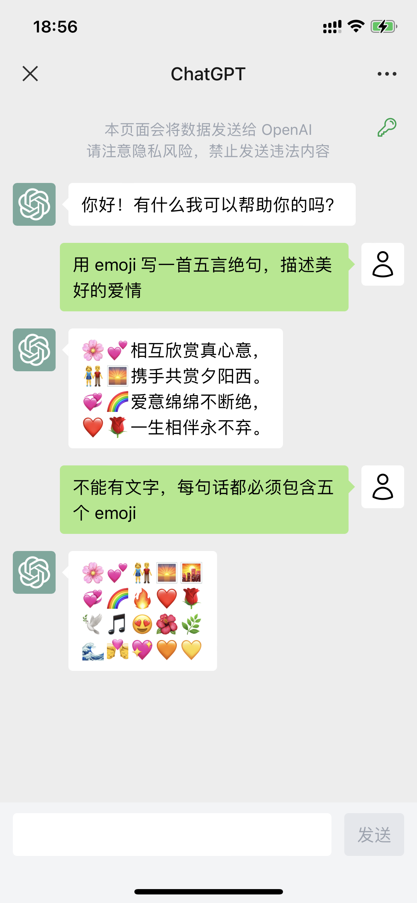
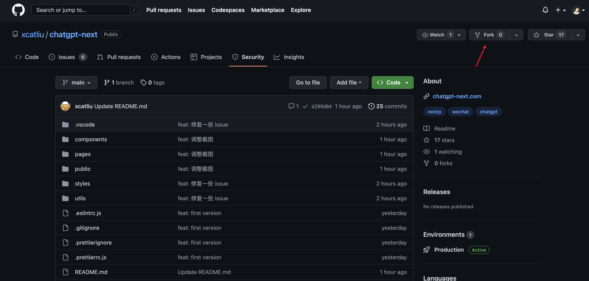
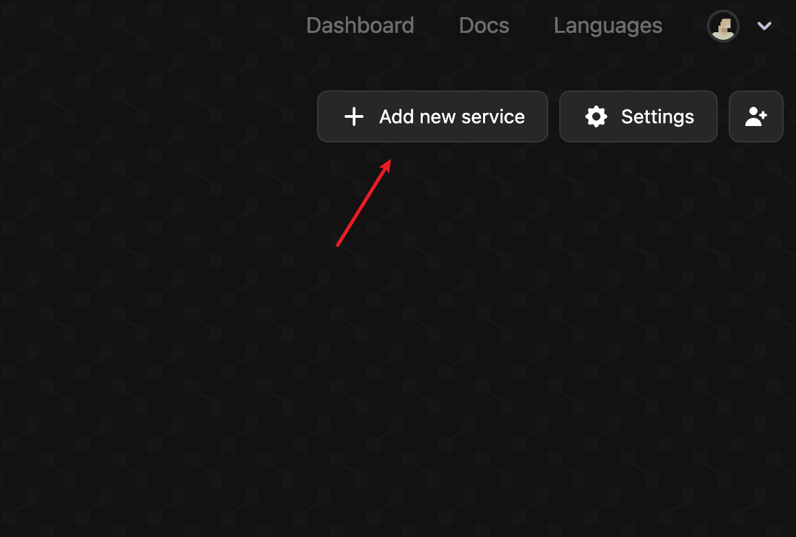
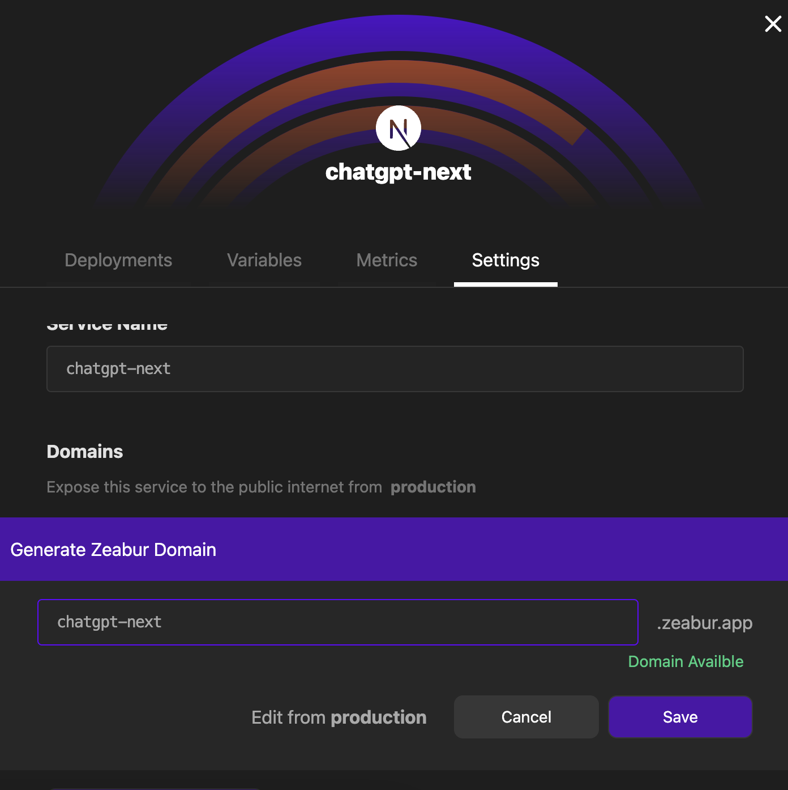

# ChatGPT Next

使用 Next.js 构建的 ChatGPT 应用，私有化部署的最佳选择！

https://chatgpt-next.com

备份网址：
- https://chatgpt-next-xcatliu.vercel.app
- https://chatgpt-next.zeabur.app

如果你也部署了一个站点并且愿意公开出来，欢迎 pr！

## 特性

- 支持私有化部署，通过环境变量配置多组密钥
- 配置密钥别名，无需暴露 apiKey 就可以分享给朋友
- 微信风格的聊天气泡，支持移动/PC 端，打造最极致的交互体验



## 快速开始

需要先安装 Node.js 环境，可以在[官网下载安装](https://nodejs.org/en/)。

```bash
# 安装依赖
npm i -g pnpm
pnpm i
# 本地开发
pnpm dev
```

## 配置

```
OPENAI_API_KEY_ALIAS=firstkey:sk-********FUt3|secondkey:sk-********f1J3
```

## 部署

```bash
# 构建
pnpm build
# 启动
pnpm start
```

也可以使用 pm2 后台运行：

```bash
# 使用 pm2 后台运行
npm i -g pm2
pm2 start npm --name chatgpt-next -- start
```

也可以使用 [Zeabur](https://github.com/zeabur) 来进行部署

- 第一步：Fork 本仓库
    
- 第二步：在 Zeabur 中创建新服务
  使用 [Zeabur](https://dash.zeabur.com)，创建一个新服务，选择 chatgpt-next 并导入部署
    
    

- 第三步：添加域名
  可以在服务的设置页面为其添加一个域名，通过该域名即可访问服务
    
    
