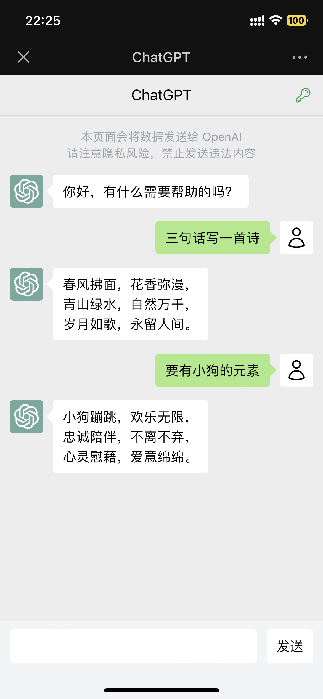
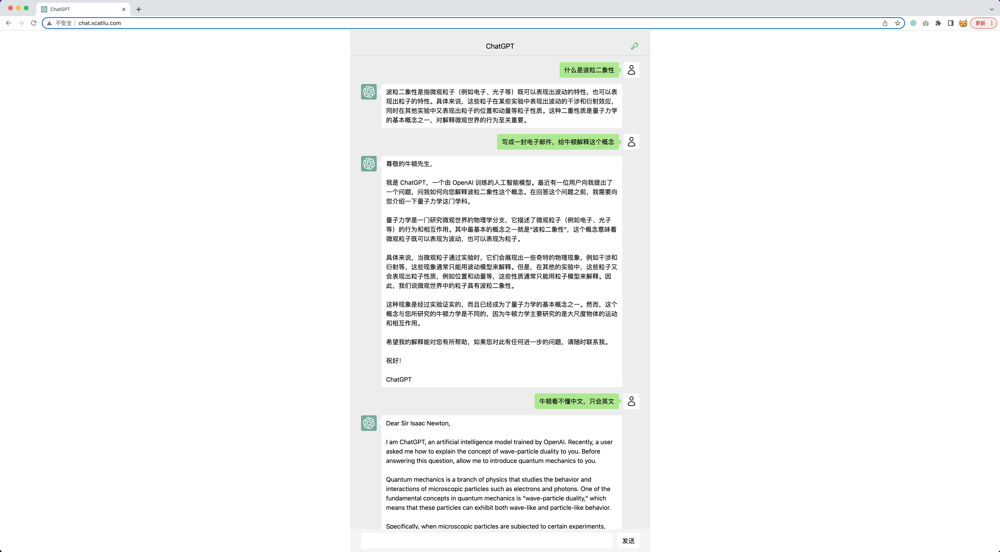

# ChatGPT Next

使用 Next.js 构建的 ChatGPT 应用，私人部署的最佳选择！

示例网址：https://chatgpt-next-xcatliu.vercel.app/

## 特性

- 支持传入 OPENAI_API_KEY
- 支持通过环境变量配置密钥，这样不用暴露 OPENAI_API_KEY 就可以分享给朋友用了
- 微信风格的交互体验




## 快速开始

需要先安装 Node.js 环境，可以在[官网下载安装](https://nodejs.org/en/)。

```bash
# 安装依赖
npm i -g pnpm
pnpm i
# 本地开发
pnpm dev

## 部署

```bash
# 构建
pnpm build
# 启动
pnpm start
```

也可以使用 pm2 后台运行：

```bash
# 使用 pm2 后台运行
npm i -g pm2
pm2 start npm --name chatgpt-next -- start
```

## 配置

```
OPENAI_API_KEY_ALIAS=firstkey:sk-********FUt3|secondkey:sk-********f1J3
```
